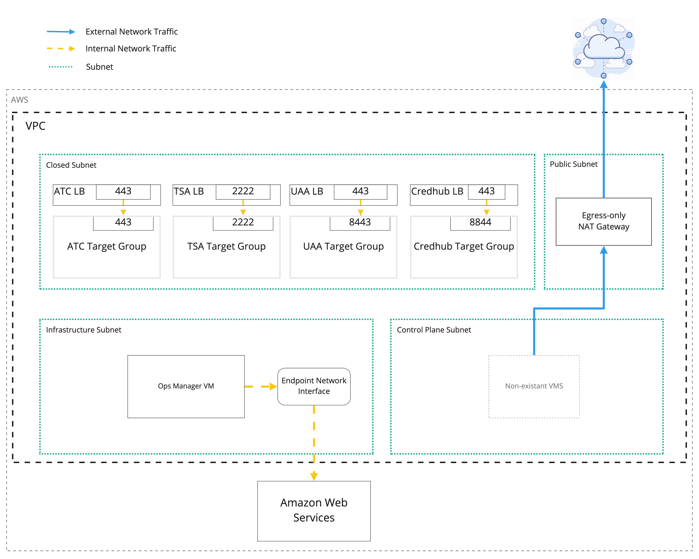

# What does this give you

By default, this will give you a VPC with an Ops Manager VM and dns entries for
Platform Automation Engine via Route53.

All subnets are inaccessible from the internet. The control plane subnet is
egress-only.
