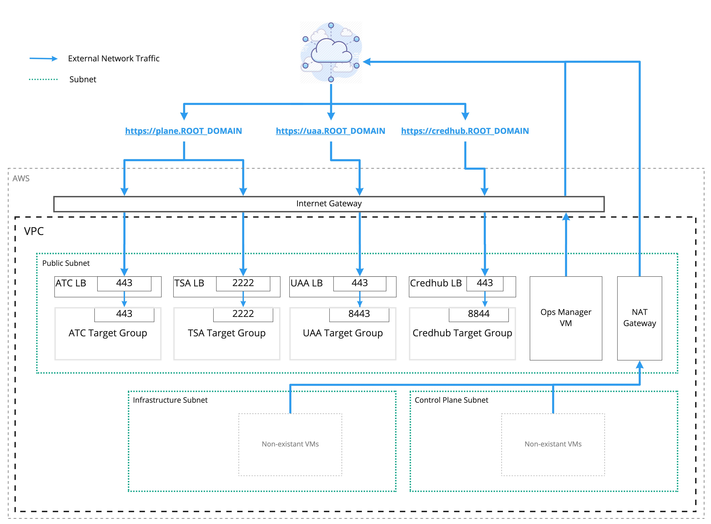

# What does this give you

By default, this will give you a VPC with an Ops Manager VM and dns entries for
Platform Automation Engine via Route53.

The public subnet is accessible from the internet.
